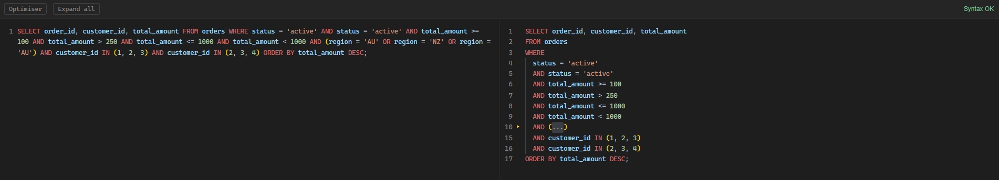
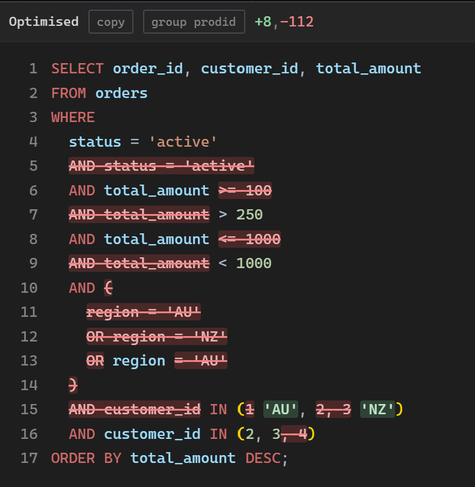

<p align="center">
  <a href="https://flynncrochon.github.io/SQL-Viewer/">
    
  </a>
</p>

<h1 align="center">SQL Viewer</h1>

<p align="center">
  View, edit, format, and safely optimise long SQL statements locally in the browser.
</p>

<p align="center">
  <a href="https://github.com/flynncrochon/SQL-Viewer/actions/workflows/test.yml"></a>
  <a href="https://flynncrochon.github.io/SQL-Viewer/"></a>
  
  <a href="LICENSE"></a>
</p>

<p align="center">
  <a href="https://flynncrochon.github.io/SQL-Viewer/">https://flynncrochon.github.io/SQL-Viewer/</a>
</p>

<p align="center">
  <a href="https://flynncrochon.github.io/SQL-Viewer/"></a>
</p>

<p align="center">
  <a href="https://flynncrochon.github.io/SQL-Viewer/"></a>
</p>

## Features

- SQL syntax highlighting and bracket folding.
- Column (box) selection and multiple carets, as in Visual Studio.
  `Alt`+drag draws a box, `Ctrl`+`Alt`+drag or click adds another caret or
  selection, and `Ctrl`+`Alt`+`Up`/`Down` stacks carets in a column. The box
  keeps its rectangle over short and empty lines and the carets stay in one
  straight column, padding those lines out so typed text lands in the column
  too. Typing, `Enter`, `Tab`, `Backspace`, arrows, copy and cut all act on
  every caret; a copy of N carets pasted back into N carets lands one line on
  each. `Esc` or an ordinary click returns to a single caret.
- Live T-SQL and Access SQL validation.
- Configurable line-comment markers. The gear in the top right lists the
  characters that start a comment when they open a line (`'` and `#` by
  default); `--` and `/* */` are always recognised.
- Edits made in the formatted pane are merged back into the source without
  collapsing it: the source keeps its own line breaks and indentation, and
  only the tokens you changed are rewritten.
- `WHERE` optimisation for duplicates, ranges, constants, and equality sets.
- Optional `prodid` grouping for literal overrides into one `IN` and one
  `NOT IN` predicate.
- Column matching is case-insensitive, including bracketed identifiers; text
  literals are folded case-insensitively when equality sets are merged.

## Tests

The optimiser has an exhaustive equivalence matrix covering `AND`, `OR`, `IN`,
`=`, `!=`, `<>`, `NULL`, and multiple parenthesis layouts.

Run the tests locally with:

```bash
npm test
npm run test:sql
```

The SQLite differential suite requires Python 3. It executes the original and
optimised statements against the same generated in-memory rows, checking
exact row selection in normal mode. Grouped mode additionally checks that
explicit overrides collapse to at most one positive and one negative `prodid`
predicate; its connected-condition changes are intentional.
